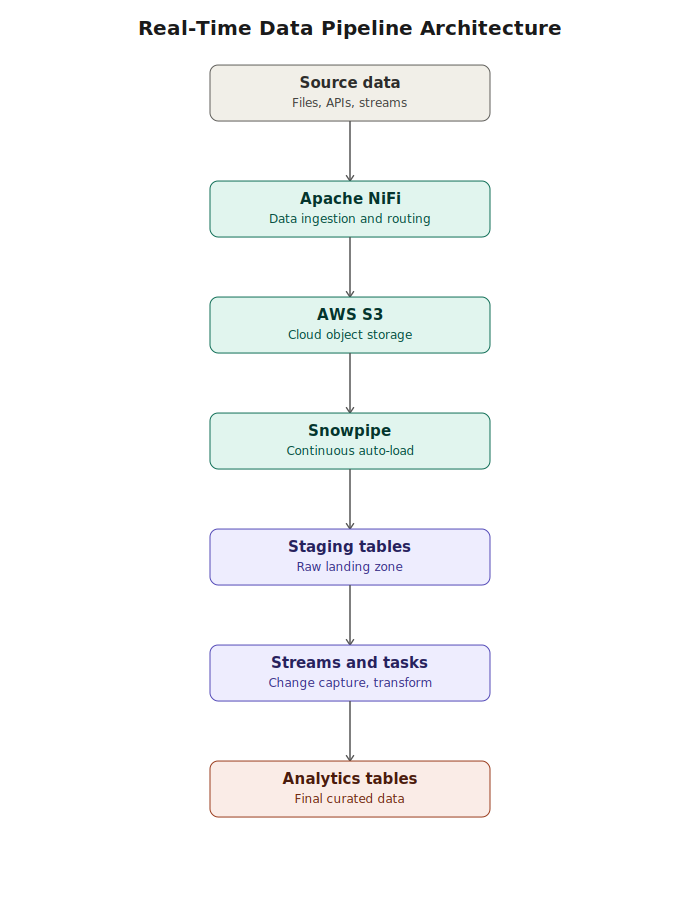
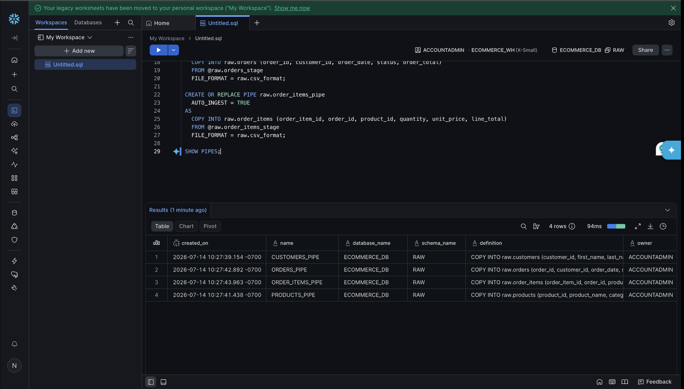

# Data Warehouse with Snowflake for Data Engineering


An end-to-end, real-time data engineering pipeline that ingests, stores, transforms, and models data using **Apache NiFi**, **AWS S3**, and **Snowflake** (Snowpipe, Streams, and Tasks).



---

## Table of contents

- [Overview](#overview)
- [Architecture](#architecture)
- [Tools and technologies](#tools-and-technologies)
- [Key features](#key-features)
- [Repository structure](#repository-structure)
- [Getting started](#getting-started)
- [Pipeline walkthrough](#pipeline-walkthrough)
- [Customer segmentation (RFM)](#customer-segmentation-rfm)
- [Screenshots](#screenshots)
- [Future improvements](#future-improvements)
- [Author](#author)

## Overview

The goal of this project is to build a modern cloud data warehouse pipeline that ingests, processes, and organizes data for analytics in real time.

Apache NiFi handles data movement from source to cloud storage, AWS S3 acts as the durable landing zone, and Snowflake handles automated loading, change tracking, and transformation — turning raw files into query-ready analytics tables with minimal manual intervention.

## Architecture
Source Data

│

▼

Apache NiFi  ──────────  ingests and routes data

│

▼

AWS S3  ───────────────  durable cloud storage (landing zone)

│

▼

Snowpipe  ─────────────  continuous, automated loading

│

▼

Snowflake Staging Tables

│

▼

Streams & Tasks  ──────  change data capture + scheduled transforms

│

▼

Final Analytics Tables

A rendered version of this diagram is in [`images/architecture.svg`](./images/architecture.svg).

## Tools and technologies

- **Snowflake** — cloud data warehouse
- **SQL** — data modeling and transformation
- **AWS S3** — cloud object storage
- **Apache NiFi** — data ingestion and flow orchestration
- **Snowpipe** — continuous, automated data loading
- **Streams** — change data capture (CDC)
- **Tasks** — scheduled, automated SQL execution
- **Jupyter Notebook** — exploration and testing

## Key features

- Real-time data ingestion from source systems
- Automated, continuous loading into Snowflake via Snowpipe
- Cloud-based staging using AWS S3
- Change data capture with Snowflake Streams
- Automated transformations with Snowflake Tasks
- SQL-based data modeling from raw to analytics-ready tables
- Customer segmentation using RFM (Recency, Frequency, Monetary) analysis

## Repository structure
.

├── nifi-pipeline/          # Apache NiFi flow definitions and configuration

├── sql/                    # Snowflake SQL: staging, streams, tasks, models

├── data/                   # Sample dataset generator + CSVs

├── docs/                   # Setup runbook

├── images/                 # Diagrams and screenshots referenced in this README

├── .gitignore

├── LICENSE

└── README.md

## Getting started

### Prerequisites

- A [Snowflake](https://signup.snowflake.com/) account (trial tier works)
- An AWS account with an S3 bucket and an IAM role/user with S3 read access
- Apache NiFi installed locally or running in a container
- Python 3.9+ and Jupyter, if you want to run the notebooks

### Setup

1. Clone the repo:
```bash
   git clone https://github.com/NehalNadipalli/data-warehouse-snowflake-for-data-engineering.git
   cd data-warehouse-snowflake-for-data-engineering
```
2. In Snowflake, run the setup scripts in `sql/` in order to create the database, staging tables, analytics tables, and the RFM segmentation.
3. (Optional, full pipeline) Create an S3 bucket, wire up Apache NiFi, and set up Snowpipe for auto-ingestion — see [`docs/RUNBOOK.md`](./docs/RUNBOOK.md) for step-by-step instructions.

## Pipeline walkthrough

1. **Ingestion** — Apache NiFi pulls data from the source and routes it to AWS S3.
2. **Storage** — Files land in a designated S3 bucket/prefix.
3. **Auto-load** — Snowpipe detects new files (via S3 event notifications) and loads them into a Snowflake staging table.
4. **Change capture** — A Snowflake Stream tracks new/changed rows in the staging table.
5. **Transformation** — A scheduled Snowflake Task consumes the stream and merges/transforms data into final analytics tables.
6. **Analytics** — Downstream tools or dashboards query the analytics tables directly.

## Customer segmentation (RFM)

On top of the base pipeline, this project includes an RFM (Recency, Frequency, Monetary) analysis that scores every customer and groups them into segments — Champion, Loyal, At risk, Regular, Lapsed — to support targeted retention efforts. See [`sql/07_customer_segmentation_rfm.sql`](./sql/07_customer_segmentation_rfm.sql).

## Screenshots

### Snowflake query results


### Apache NiFi flow
Coming soon

### AWS S3 bucket
Coming soon

## Future improvements

- [ ] Wire up Apache NiFi + AWS S3 + Snowpipe for full auto-ingestion (currently loaded via Snowflake's Load Data wizard)
- [ ] Add dbt for transformation and testing
- [ ] Add a lightweight BI dashboard (e.g. Streamlit or Power BI) on top of the analytics tables
- [ ] Add CI to lint/validate SQL on every push

## Author

**Nehal Nadipalli**
[GitHub](https://github.com/NehalNadipalli) · [LinkedIn](https://www.linkedin.com/in/nehal-nadipalli-8019a71a2/)
